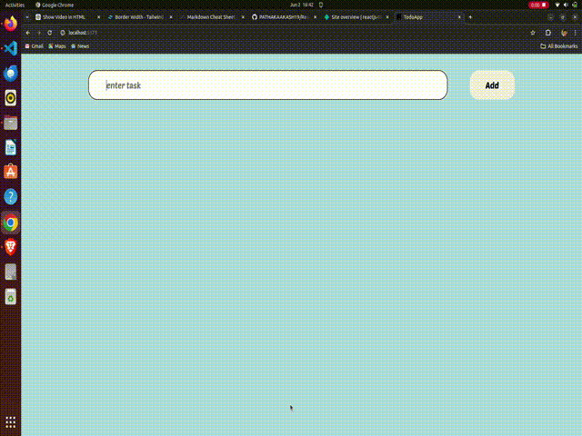

# React Todo App

This is a simple Todo App built in react 

## what I learned

1. learned about Jsx
2. react props
3. react components
4. naming convention for components in react
5. component nesting

## Project demo

## Project link

[https://reactjs-todo-app-12.netlify.app/](https://reactjs-todo-app-12.netlify.app/)

